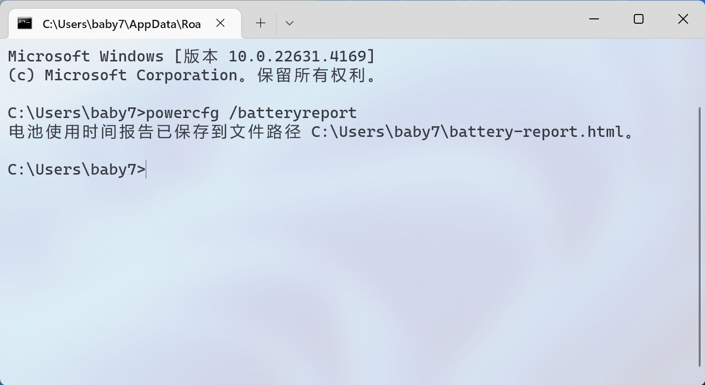
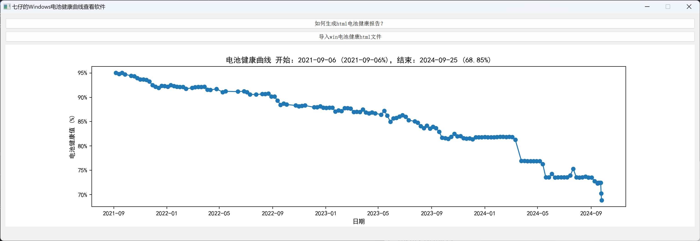

# 七仔的电池健康工具

如果使用满意欢迎点star:

[https://github.com/baby7/baby7-win-battery-health](https://github.com/baby7/baby7-win-battery-health)

如果导入有什么问题，欢迎提issue，最好能直接粘贴html文件

## 使用方法

1. 打开cmd窗口，输入下方命令:
 
```shell
powercfg /batteryreport
```



2. 打开软件，点击上方的按钮[导入win电池健康html文件]，然后选择刚才生成的html报告即可



另：折线图上方的标题处有开始结束的时间和电池健康度

## 下载和运行:

1. 可以clone这个项目，然后直接运行main.py

2. GitHub上有编译好的exe文件，直接下载即可：

[https://github.com/baby7/baby7-win-battery-health/releases](https://github.com/baby7/baby7-win-battery-health/releases)

3. 百度网盘：

链接：https://pan.baidu.com/s/1gkgJyVZ6vZbtSfo3b4l3hQ?pwd=baby 

提取码：baby

4. 蓝奏：

https://wwta.lanzoue.com/ir3jA2aw7e1c
