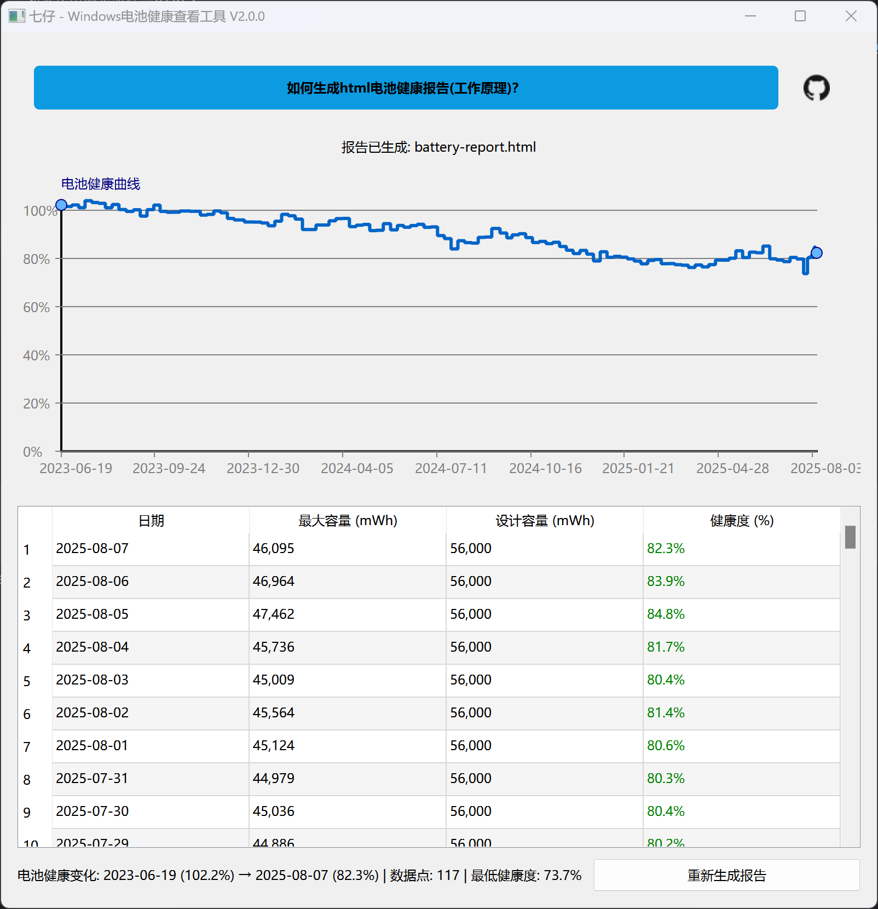

# 七仔的电池健康工具

如果使用满意欢迎点star:

[https://github.com/baby7/baby7-win-battery-health](https://github.com/baby7/baby7-win-battery-health)

如果导入有什么问题，欢迎提issue，最好能直接粘贴html文件

## 使用方法

打开即可看到电池健康度:

## 下载和运行:

1. 可以clone这个项目，然后直接运行Baby7WinBatteryHealth.py

2. 可以clone这个项目，然后使用build_exe.py打包为exe文件

2. GitHub上有使用编译好的exe文件，直接下载即可：

[https://github.com/baby7/baby7-win-battery-health/releases](https://github.com/baby7/baby7-win-battery-health/releases)

3. 百度网盘：

链接: https://pan.baidu.com/s/1KslcNstR5BihuTawsoW_ag?pwd=2ts4

提取码: 2ts4

4. 蓝奏：

https://wwta.lanzoue.com/i68zp34r5prc

提取码: c8um